<!--
  Profile of Sethy Pagna UNG (Pagna).
  Every graphic in assets/ is drawn in code by scripts/build_assets.py; see scripts/README.md to rebuild them.
  The activity card and contribution skyline are rebuilt daily by .github/workflows/profile-assets.yml.
  The portfolio website (sethy-pagna.vercel.app) is the static site in portfolio/; see portfolio/README.md.
-->

  &nbsp;
  &nbsp;
  

**Start here:** [Explore the portfolio](https://sethy-pagna.vercel.app/) · [Open the browser arcade](https://sethy-pagna.vercel.app/#arcade) · [See current projects](#current-projects)

<h3></h3>

I'm **Pagna** (Sethy Pagna UNG; James is my English nickname), a Computer Science student at The Hong Kong Polytechnic University, with graduation **expected in July 2027**. I build and refine software for everyday work, learning and play, with a particular interest in useful AI tools and software for Cambodia. I speak Khmer, English and Mandarin, and I've studied across Cambodia, Malaysia, China, Australia and Hong Kong.

**Open to internships** in software development, AI applications or game development.

<h3></h3>

### Current projects

Updated **1 October 2026**. The portfolio brings the projects together with screenshots, clear controls and links to the available builds.

| Start with | What you can explore | Available version |
|---|---|---|
| [Business OS](https://leangbeauty.com) | Retail storefront, connected to point of sale, inventory and branch operations in English and Khmer | Live storefront; staff tools require access |
| [LEARN](https://sethy-pagna.vercel.app/#project/learn) | A study workspace connecting notes and documents with tutoring and practice | Public previews; the newer studio remains in development |
| [AllChess](https://sethy-pagna.vercel.app/#arcade/allchess) | 21 board games with browser bots, local pass-and-play, rule guides, saved games and 3D boards | Browser arcade · [30 September source](https://github.com/SethyPagna/AllChess/tree/9d2b7ff66636a4669c1519f9d337b682832759d1) |
| [UrCut + UrVoice](https://urcut-preview.ungsethypagna.workers.dev) | Import media, edit a timeline and export video on your device | Desktop web preview; voice generation needs the local app |
| [CodeAge](https://sethy-pagna.vercel.app/#project/codeage) | AI conversations beside code, terminals and Git diffs, with local/API models and offline speech | Windows local alpha; installer validation continues |
| [EdSync](https://edsync-demo.learn-app.workers.dev) | Fictional courses and learner/teacher views | Read-only demo; official app has account access |
| [Living Kingdom](https://sethy-pagna.vercel.app/#arcade/living-kingdom) | A founder's fantasy world with gathering, combat and a quest loop | Browser edition of the Unreal playtest |
| [Sandline](https://sethy-pagna.vercel.app/#arcade/sandline) | Offline shooter matches against bots | Desktop browser edition; online multiplayer is unfinished |
| [Cargo Twin](https://sethy-pagna.vercel.app/#arcade/cargo-twin) | Plan constrained packing and replay a 3D load sequence | Browser studio v3; originated as a team hackathon project |
| [AI Summary](https://ai-summary.ungsethypagna.workers.dev) | Local document ingestion, summaries, cited Q&A and study cards | Browser app v2; local analysis with optional Claude |

Browser editions and previews have their own release state. The project pages identify the available build separately from newer source and earlier versions.

<h3></h3>

  
  
  
  
  
  
  
  

**Play in the browser:** [Sandline](https://sethy-pagna.vercel.app/#arcade/sandline) · [Living Kingdom](https://sethy-pagna.vercel.app/#arcade/living-kingdom) · [AllChess](https://sethy-pagna.vercel.app/#arcade/allchess) · [Cargo Twin](https://sethy-pagna.vercel.app/#arcade/cargo-twin) · [AI Summary](https://sethy-pagna.vercel.app/#arcade/ai-summary)

**Additional app links:** [LEARN Vercel preview](https://learn-ten-pearl.vercel.app) · [LEARN Cloudflare preview](https://learn.learn-app.workers.dev) · [AllChess older online app](https://allchess.learn-app.workers.dev) · [EdSync official app](https://edsync.learn-app.workers.dev)

The two LEARN previews run different earlier builds. CodeAge, UrCut + UrVoice, Living Kingdom, Sandline, OmniDrama and KhShop have private source; the portfolio provides project descriptions and screenshots. UrCut builds on [OpenCut classic](https://github.com/OpenCut-app/opencut-classic) (MIT).

<h3></h3>

  
  
  
  
  
  

**More projects:** [OmniDrama](https://sethy-pagna.vercel.app/#project/omnidrama) is a local video library and player in development. [KhShop](https://sethy-pagna.vercel.app/#project/khshop) is a Khmer-first marketplace prototype connecting buyers, sellers and staff; its gallery shows an earlier pilot. [JARVIS](https://github.com/SethyPagna/Secretary-Jarvis) is an experimental desktop agent built on [Hermes Agent](https://github.com/NousResearch/hermes-agent) (MIT).

[Wreckabulary](https://github.com/SethyPagna/wreckabulary/tree/6030d6b8ba8024e7eaf108efd88db6a0b0a3f019) is a public personal fork of a Unity team/course project. Its prototype includes 100 HP health separate from letters, inventory and crafting, and keyboard, mouse and gamepad character controls. Multiplayer remains unfinished; the gallery shows team concept mock-ups.

Cargo Twin's current studio grows from the team's hackathon prototype. AI Summary v2 replaces the earlier Supabase app; its linked source identifies the browser build.

<b>Course projects</b>

 

| Project | What it is |
|---|---|
| [Secure instant messaging](https://github.com/SethyPagna/Comp3334_G22_Secure-Instant-Messaging-with-End-to-End-Encryption) | COMP3334 group project: messaging with end-to-end encryption |
| [Information systems development](https://github.com/SethyPagna/Comp3122_G13_Information-Systems-Development) | COMP3122 group project |
| [COMP2021 project](https://github.com/SethyPagna/COMP2021Project) | Group course project (fork of the team repository) |
| Operating systems | COMP2432 group project in C (private repository) |

<h3></h3>

I set the product direction, requirements and feedback, and use Claude and Codex for much of the implementation, debugging and testing. I review the behaviour and study the code and architecture as the projects grow. I also turn verified lessons into reusable skills and workflows, improving how the AI and I work together from one iteration to the next.

<h3></h3>

<h3></h3>

These are tools used across my projects. Current work centres on **TypeScript, React/Next.js, Cloudflare, Python, Electron and Unreal Engine**. Docker, PostgreSQL, Redis/BullMQ and DuckDB also appear in archived work; the current project pages give each stack in context.

<h3></h3>

<h3></h3>

<h3></h3>

🏀 basketball&nbsp; · &nbsp;⚽ football&nbsp; · &nbsp;🏸 badminton&nbsp; · &nbsp;🏊 swimming&nbsp; · &nbsp;🏓 table tennis

