<!--
  Profile of Sethy Pagna UNG (Pagna).
  Every graphic in assets/ is drawn in code by scripts/build_assets.py; see scripts/README.md to rebuild them.
  The activity card and contribution skyline are rebuilt daily by .github/workflows/profile-assets.yml.
  The portfolio website (sethy-pagna-portfolio.vercel.app) is the static site in portfolio/; see portfolio/README.md.
-->

<a href="https://sethy-pagna-portfolio.vercel.app"></a>

  <a href="https://sethy-pagna-portfolio.vercel.app">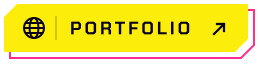</a>&nbsp;
  &nbsp;
  

<h3>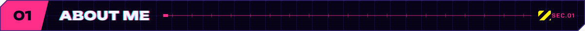</h3>

I'm **Pagna** (Sethy Pagna UNG, or James), a Computer Science student at The Hong Kong Polytechnic University, graduating in July 2027. I build and refine software for everyday work, learning and play, with a particular interest in useful AI tools and software for Cambodia. I speak Khmer, English and Mandarin, and I've studied across Cambodia, Malaysia, China, Australia and Hong Kong.

**Open to internships** in software development, AI applications or game development.

<h3>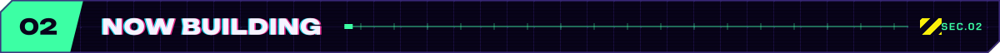</h3>

<h3>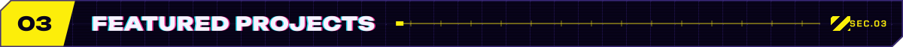</h3>

  <a href="https://github.com/SethyPagna/business-os"></a>
  <a href="https://github.com/SethyPagna/LEARN"></a>
  <a href="https://sethy-pagna-portfolio.vercel.app/#project/codeage"></a>
  <a href="https://sethy-pagna-portfolio.vercel.app/#project/urcut"></a>
  <a href="https://github.com/SethyPagna/AllChess"></a>
  <a href="https://github.com/SethyPagna/EdSync"></a>
  <a href="https://sethy-pagna-portfolio.vercel.app/#project/living-kingdom"></a>
  <a href="https://sethy-pagna-portfolio.vercel.app/#project/sandline"></a>

  <b>Try them live:</b>
  <a href="https://leangbeauty.com">Business OS</a> ·
  <a href="https://learn-ten-pearl.vercel.app">LEARN</a> ·
  <a href="https://allchess.learn-app.workers.dev">AllChess</a> ·
  <a href="https://edsync-two.vercel.app">EdSync</a>
   
  <b>Play in your browser:</b>
  <a href="https://sethy-pagna-portfolio.vercel.app/#arcade/sandline">Sandline</a> ·
  <a href="https://sethy-pagna-portfolio.vercel.app/#arcade/living-kingdom">Living Kingdom</a> ·
  <a href="https://sethy-pagna-portfolio.vercel.app/#arcade/allchess">AllChess</a> ·
  <a href="https://sethy-pagna-portfolio.vercel.app/#arcade/cargo-twin">Cathay Cargo Twin</a> ·
  <a href="https://sethy-pagna-portfolio.vercel.app/#arcade/ai-summary">AI Summary</a>
   
  CodeAge, UrCut + UrVoice, Living Kingdom, Sandline, OmniDrama and KhShop are private repositories: the portfolio has screenshots of each.
  UrCut is built on <a href="https://github.com/OpenCut-app/OpenCut">OpenCut</a> (MIT).

<h3>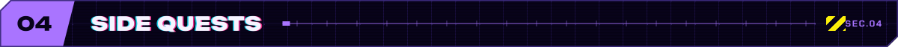</h3>

  <a href="https://sethy-pagna-portfolio.vercel.app/#project/omnidrama">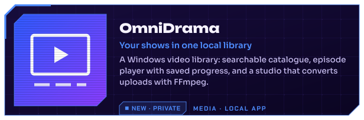</a>
  <a href="https://sethy-pagna-portfolio.vercel.app/#project/khshop">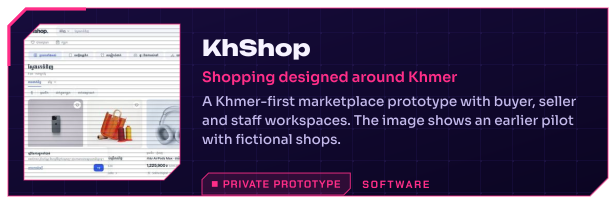</a>
  <a href="https://github.com/SethyPagna/Secretary-Jarvis">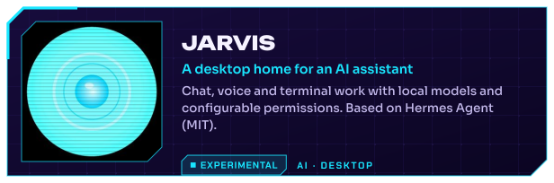</a>
  <a href="https://github.com/SethyPagna/ai-summary-app">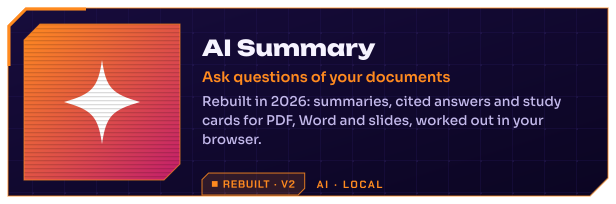</a>
  <a href="https://github.com/SethyPagna/wreckabulary">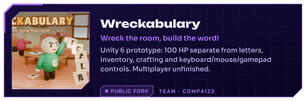</a>
  <a href="https://github.com/SethyPagna/Ainnovator_Prototype">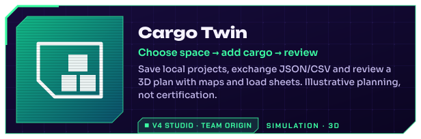</a>

<b>Course projects</b>

 

| Project | What it is |
|---|---|
| [Secure instant messaging](https://github.com/SethyPagna/Comp3334_G22_Secure-Instant-Messaging-with-End-to-End-Encryption) | COMP3334 group project: messaging with end-to-end encryption |
| [Information systems development](https://github.com/SethyPagna/Comp3122_G13_Information-Systems-Development) | COMP3122 group project |
| [COMP2021 project](https://github.com/SethyPagna/COMP2021Project) | Group course project (fork of the team repository) |
| Operating systems | COMP2432 group project in C (private repository) |

<h3>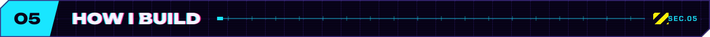</h3>

I'm open about this: I set the product direction, requirements and feedback, and I use Claude and Codex for much of the implementation, debugging and testing. I'm building a deeper understanding of the code and architecture as the projects grow. The AI grows with the work too: each loop's experience becomes reusable skills, and I keep designing the workflow and perfecting it as we go.

<h3>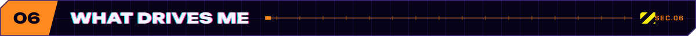</h3>

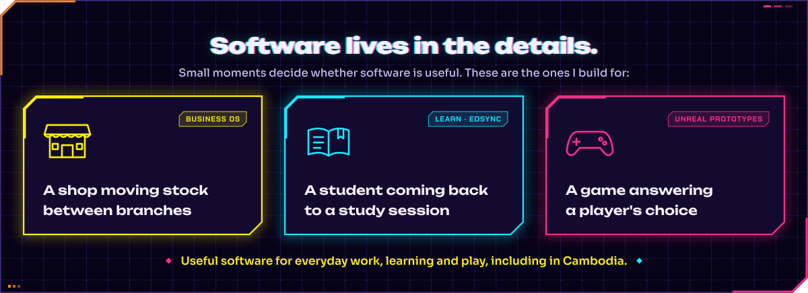

<h3>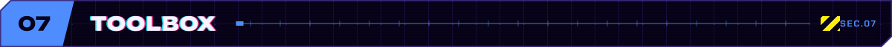</h3>

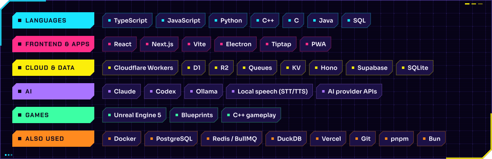

<h3>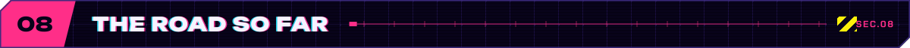</h3>

<h3>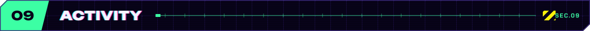</h3>

<h3></h3>

🏀 basketball&nbsp; · &nbsp;⚽ football&nbsp; · &nbsp;🏸 badminton&nbsp; · &nbsp;🏊 swimming&nbsp; · &nbsp;🏓 table tennis

<a href="https://sethy-pagna-portfolio.vercel.app">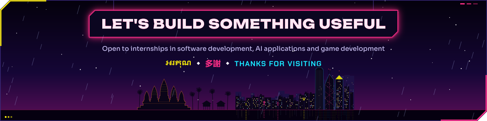</a>
