<!--
  Profile of Sethy Pagna UNG (Pagna).
  Every graphic in assets/ is drawn in code by scripts/build_assets.py; see scripts/README.md to rebuild them.
  The activity card and contribution skyline are rebuilt daily by .github/workflows/profile-assets.yml.
  The portfolio website (sethy-pagna.pages.dev) is the static site in portfolio/; see portfolio/README.md.
-->

  &nbsp;
  &nbsp;
  

**Start here:** [Explore the portfolio](https://sethy-pagna.pages.dev/) · [Open the browser arcade](https://sethy-pagna.pages.dev/#arcade) · [See current projects](#current-projects)

<h3></h3>

I'm **Pagna** (Sethy Pagna UNG; James is my English nickname), a Computer Science student at The Hong Kong Polytechnic University, with graduation **expected in July 2027**. I build and refine software for everyday work, learning and play, with a particular interest in useful AI tools and software for Cambodia. I speak Khmer, English and Mandarin, and I've studied across Cambodia, Malaysia, China, Australia and Hong Kong.

**Open to internships** in software development, AI applications or game development.

<h3></h3>

### Current projects

Updated **3 October 2026**. Use the project links below to see the available builds, screenshots and release notes.

| Start with | What you can explore | Available version |
|---|---|---|
| [Business OS](https://leangbeauty.com) | Retail storefront, connected to point of sale, inventory and branch operations in English and Khmer | Live storefront; staff tools require access |
| [LEARN](https://learn.pagna.workers.dev) | Capture notes, create documents and practise with tutoring; try an editable public canvas | Latest Cloudflare app; AI tools need a configured provider |
| [AllChess](https://allchess.pagna.workers.dev/en) | 21 board games with browser bots, local pass-and-play, rule guides, saved games and 3D boards | Current standalone app · [release source](https://github.com/SethyPagna/AllChess/tree/f30b8b62a26b6b43c131ab2ef93a716d27960a5c); arcade offers bot/local play |
| [UrCut + UrVoice](https://sethy-pagna.pages.dev/#project/urcut) | Import media, edit a timeline with effects, captions and sound, then export on your device | Latest local editor; public release pending; voice generation needs local UrVoice |
| [CodeAge](https://codeage-pagna.pages.dev) | Browser-local chats, projects and text editing with an isolated HTML/JavaScript preview and your own AI provider key | Web alpha 0.8.3-web.1; Windows tools are separate |
| [EdSync](https://edsync.pagna.workers.dev) | Classroom workflows connecting lessons, assignments, gradebooks and learner progress | Official app; account access required |
| [Living Kingdom](https://sethy-pagna.pages.dev/#arcade/living-kingdom) | A founder's fantasy world with gathering, combat and a quest loop | Browser edition of the Unreal playtest |
| [Sandline](https://sandline.pagna.workers.dev) | Offline shooter matches against bots | Desktop browser edition; online multiplayer is unfinished |
| [Cargo Twin](https://cargo-twin.pages.dev) | Choose a space, add cargo and review a 3D plan; save projects, exchange JSON/CSV and prepare a load sheet | Browser studio v4; team hackathon origin; illustrative planning |
| [AI Summary](https://sethy-pagna.pages.dev/#arcade/ai-summary) | Local document ingestion, summaries, cited Q&A and study cards | Browser app v2; local analysis with optional Claude |
| [Wreckabulary](https://sethy-pagna.pages.dev/#arcade/wreckabulary) | Wreck rooms, collect letters and craft objects; play five modes with AI housemates or build in Creative Workshop | Public JavaScript/Three.js browser prototype; one human player; online multiplayer unfinished |

Browser editions and previews have their own release state. AllChess’s [local arcade export](https://sethy-pagna.pages.dev/#arcade/allchess) was built from [30 September source](https://github.com/SethyPagna/AllChess/tree/9d2b7ff66636a4669c1519f9d337b682832759d1) and shares the current game studio, rules and artwork; the online workspace is in the standalone app. The project pages identify earlier versions separately.

<h3></h3>

  
  
  
  
  
  
  
  

**Play in the browser:** [Sandline](https://sethy-pagna.pages.dev/#arcade/sandline) · [Living Kingdom](https://sethy-pagna.pages.dev/#arcade/living-kingdom) · [AllChess](https://sethy-pagna.pages.dev/#arcade/allchess) · [Cargo Twin](https://sethy-pagna.pages.dev/#arcade/cargo-twin) · [AI Summary](https://sethy-pagna.pages.dev/#arcade/ai-summary) · [Wreckabulary](https://sethy-pagna.pages.dev/#arcade/wreckabulary)

**Additional app links:** [LEARN Cloudflare app](https://learn.pagna.workers.dev) · [CodeAge web alpha](https://codeage-pagna.pages.dev) · [OmniDrama original preview](https://omnidrama.pagna.workers.dev) · [EdSync official app](https://edsync.pagna.workers.dev)

UrCut's public release is pending. LEARN's AI tools need a configured provider and collaboration remains in development. CodeAge's browser alpha stores work on the current device; it has no device sync. Real terminals, CLI agents, Ollama and offline speech belong to its separate Windows 0.8.3 alpha; a public desktop installer is not available. CodeAge, UrCut + UrVoice, Living Kingdom, Sandline, OmniDrama and KhShop have private source. UrCut builds on [OpenCut classic](https://github.com/OpenCut-app/opencut-classic) (MIT).

<h3></h3>

  
  
  
  
  
  

**More projects:** [OmniDrama](https://omnidrama.pagna.workers.dev) offers two original short chapters in a public browser preview, with the full library and import workflow in its separate Windows app. [KhShop](https://sethy-pagna.pages.dev/#project/khshop) is a Khmer-first marketplace prototype connecting buyers, sellers and staff; its gallery shows an earlier pilot. [JARVIS](https://github.com/SethyPagna/Secretary-Jarvis) is an experimental desktop agent built on [Hermes Agent](https://github.com/NousResearch/hermes-agent) (MIT).

[Wreckabulary](https://github.com/SethyPagna/wreckabulary/tree/11f72937beaf19e9eab4b3b53634bec7849b729f/Web) now has a separate JavaScript/Three.js browser prototype: one human player, AI housemates, five modes and Creative Workshop. Health, letters, inventory and crafting connect the game loop; online multiplayer and a second local human player remain unfinished. It grows from a Unity team/course project; the current gallery shows real browser gameplay and Workshop captures, with that team origin retained in the project description.

[Cargo Twin v4 source](https://github.com/SethyPagna/cargo-twin/tree/10e4151bfa8b0cb20135c1b3126514c144559c67/cargo-twin) grows from the team's hackathon prototype. Its guided planning and load sheets are illustrative rather than a transport certification tool. AI Summary v2 replaces the earlier Supabase app; its linked source identifies the browser build.

<b>Course projects</b>

 

| Project | What it is |
|---|---|
| [Secure instant messaging](https://github.com/SethyPagna/Comp3334_G22_Secure-Instant-Messaging-with-End-to-End-Encryption) | COMP3334 group project: messaging with end-to-end encryption |
| [Information systems development](https://github.com/SethyPagna/Comp3122_G13_Information-Systems-Development) | COMP3122 group project |
| [COMP2021 project](https://github.com/SethyPagna/COMP2021Project) | Group course project (fork of the team repository) |
| Operating systems | COMP2432 group project in C (private repository) |

<h3></h3>

I set the product direction, requirements and feedback, and use Claude and Codex for much of the implementation, debugging and testing. I review the behaviour and study the code and architecture as the projects grow. I also turn verified lessons into reusable skills and workflows, improving how the AI and I work together from one iteration to the next.

<h3></h3>

<h3></h3>

These are tools used across my projects. Current work centres on **TypeScript, React/Next.js, Cloudflare, Python, Electron and Unreal Engine**. Docker, PostgreSQL, Redis/BullMQ and DuckDB also appear in archived work; the current project pages give each stack in context.

<h3></h3>

<h3></h3>

<h3></h3>

🏀 basketball&nbsp; · &nbsp;⚽ football&nbsp; · &nbsp;🏸 badminton&nbsp; · &nbsp;🏊 swimming&nbsp; · &nbsp;🏓 table tennis

